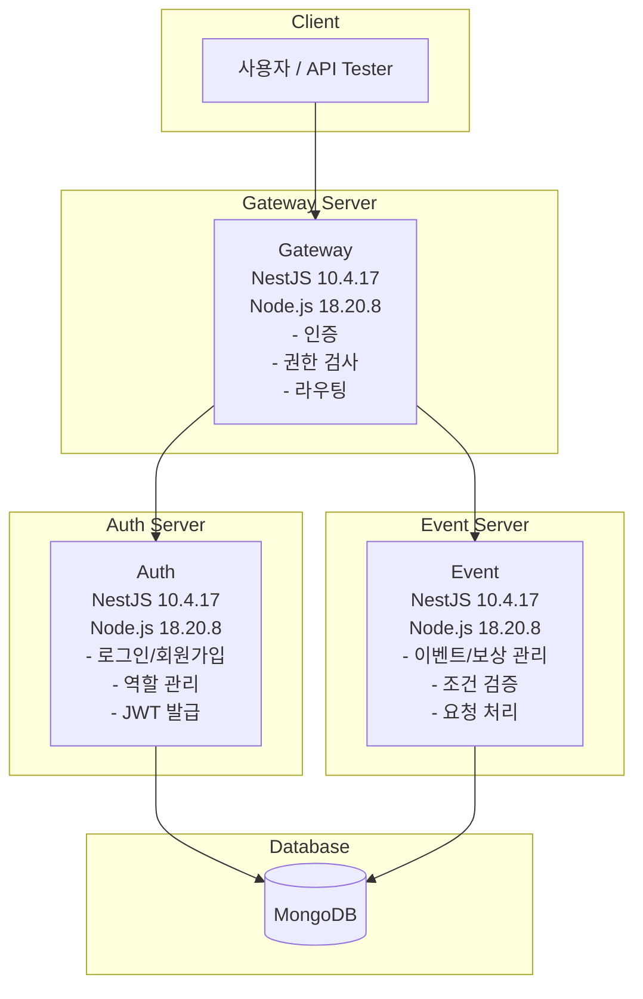
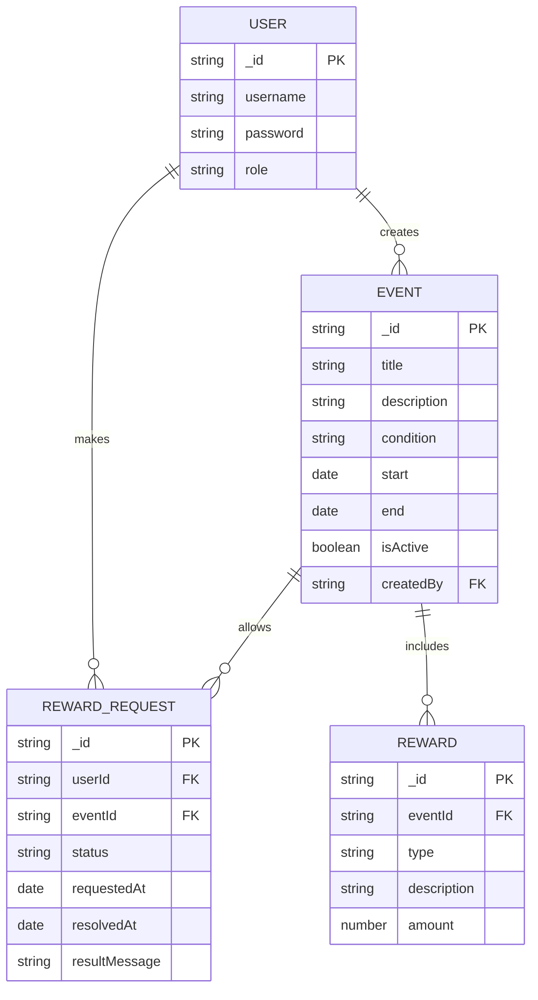

# 이벤트 / 보상 관리 플랫폼

## 📌 개요

이 프로젝트는 운영자/관리자가 손쉽게 이벤트를 생성하고, 유저는 조건을 만족했을 때 직접 보상을 요청할 수 있는 **이벤트 / 보상 관리 시스템**입니다.  
실무에서 사용 가능한 구조와 보안, 역할 구분 등을 고려한 **NestJS 기반 MSA 구조**로 설계되었습니다.

---

## 🧱 아키텍처 구성

### 서비스 구조 (MSA 기반)

<details>
<summary>Mermaid 코드 보기</summary> 



</details>

* **Gateway Server**

    * API 진입점
    * JWT 인증 및 역할(Role) 검사
    * 요청 라우팅 처리

* **Auth Server**

    * 유저 등록/로그인
    * JWT 발급 및 검증
    * 역할 관리: `USER`, `OPERATOR`, `AUDITOR`, `ADMIN`

* **Event Server**

    * 이벤트/보상 등록 및 조회
    * 유저 보상 요청 처리
    * 보상 지급 상태 저장 및 이력 관리

### 프로젝트 구조

```
event-reward-platform/
├── apps/
│   ├── gateway/
│   │   ├── src/
│   │   │   ├── main.ts
│   │   │   ├── app.module.ts
│   │   │   ├── auth.guard.ts
│   │   │   ├── roles.guard.ts
│   │   │   └── routes/
│   │   │       └── proxy.module.ts
│   │   └── Dockerfile
│   │
│   ├── auth/
│   │   ├── src/
│   │   │   ├── main.ts
│   │   │   ├── app.module.ts
│   │   │   ├── auth/
│   │   │   │   ├── auth.controller.ts
│   │   │   │   ├── auth.service.ts
│   │   │   │   └── jwt.strategy.ts
│   │   │   └── users/
│   │   │       ├── user.entity.ts
│   │   │       └── user.service.ts
│   │   └── Dockerfile
│   │
│   └── event/
│       ├── src/
│       │   ├── main.ts
│       │   ├── app.module.ts
│       │   ├── events/
│       │   │   ├── event.entity.ts
│       │   │   ├── event.controller.ts
│       │   │   └── event.service.ts
│       │   ├── rewards/
│       │   │   ├── reward.entity.ts
│       │   │   ├── reward.controller.ts
│       │   │   └── reward.service.ts
│       │   └── reward-requests/
│       │       ├── reward-request.entity.ts
│       │       ├── reward-request.controller.ts
│       │       └── reward-request.service.ts
│       └── Dockerfile
│
├── libs/
│   ├── common/
│   │   ├── decorators/
│   │   ├── dtos/
│   │   ├── filters/
│   │   ├── guards/
│   │   ├── interceptors/
│   │   └── utils/
│   └── constants/
│
├── docker-compose.yml
├── .env
├── README.md
└── tsconfig.json
```

### 구조 설명

* **apps/**: MSA 구조의 각 서비스 (gateway, auth, event)를 포함
* **libs/common/**: NestJS에서 공유 가능한 데코레이터, 필터, 가드, 유틸 등의 공용 모듈 집합
* **docker-compose.yml**: 전체 서비스 통합 실행
* **.env**: 공통 환경 변수 파일

### 확장 고려 포인트

* `libs/shared-db/` 디렉터리로 공통 DB 연결 모듈을 만들 수 있음
* `@nestjs/config`을 통한 환경 설정 관리 권장
* 향후 Redis, Kafka 등 인프라 모듈을 `infra/`로 분리해 구성 가능

---

## 🧩 DB 스키마 (MongoDB)

<details>
<summary>Mermaid 코드 보기</summary> 



</details>

### User (Auth Server)

````
{
  _id: ObjectId,
  username: string,
  password: string(hashed),
  role: 'USER' | 'OPERATOR' | 'AUDITOR' | 'ADMIN'
}
````

### Event (Event Server)

```
{
  _id: ObjectId,
  title : string,
  description : string,
  condition : string, // e.g., 'login_3_days'
  duration : {
    start: Date,
    end: Date
  },
  isActive: boolean,
  createdBy: ObjectId(User)
}
```

### Reward

```
{
  _id: ObjectId,
  eventId: ObjectId(Event),
  type: 'POINT' | 'ITEM' | 'COUPON',
  description: string,
  amount: number
}
```

### RewardRequest

```
{
  _id: ObjectId,
  userId: ObjectId(User),
  eventId: ObjectId(Event),
  status: 'PENDING' | 'GRANTED' | 'REJECTED',
  requestedAt: Date,
  resolvedAt?: Date,
  resultMessage?: string
}
```

---

## 📡 REST API 명세

### 공통 사항

* 인증: JWT (`Authorization: Bearer <token>`)
* 응답 형식: `application/json`

### Auth Server

| 메서드  | 경로               | 설명                     |
|------|------------------|------------------------|
| POST | `/auth/register` | 회원가입 (JWT 필요X)         |
| POST | `/auth/login`    | 로그인 및 JWT 발급 (JWT 필요X) |
| GET  | `/auth/profile`  | 로그인 유저 정보 조회           |

---

### Event Server

#### \[이벤트]

| 메서드  | 경로            | 설명        | 권한                  |
|------|---------------|-----------|---------------------|
| POST | `/events`     | 이벤트 생성    | `OPERATOR`, `ADMIN` |
| GET  | `/events`     | 전체 이벤트 조회 | 전체                  |
| GET  | `/events/:id` | 이벤트 상세 조회 | 전체                  |

#### \[보상]

| 메서드  | 경로                     | 설명         | 권한                  |
|------|------------------------|------------|---------------------|
| POST | `/rewards`             | 보상 등록      | `OPERATOR`, `ADMIN` |
| GET  | `/rewards?eventId=xxx` | 이벤트별 보상 조회 | 전체                  |

#### \[보상 요청]

| 메서드  | 경로                     | 설명          | 권한                             |
|------|------------------------|-------------|--------------------------------|
| POST | `/rewards/request`     | 보상 요청       | `USER`                         |
| GET  | `/rewards/request`     | 본인 요청 이력 조회 | `USER`                         |
| GET  | `/rewards/request/all` | 전체 요청 이력 조회 | `AUDITOR`, `OPERATOR`, `ADMIN` |

---

## 🐳 실행 방법 (Docker Compose)

```bash
# 1. 저장소 클론
$ git clone <레포 주소>
$ cd event-reward-platform

# 2. Docker Compose 실행
$ docker-compose up --build
```

각 서버는 다음 포트를 사용합니다:

* Gateway: `3000`
* Auth: `3001`
* Event: `3002`

---

## ✍️ 설계 의도 및 보완점

* 역할 기반 인증은 **NestJS의 Guard**를 통해 구현
* 이벤트 조건은 문자열로 관리하며, 나중에 DSL 파서나 엔진 도입 여지 고려
* MSA 간 인증은 내부 Secret 기반의 JWT 공유 구조로 처리 가능
* 향후 Redis, Kafka 등으로 확장 가능성 있음

---

## 🧪 테스트 (선택 사항)

* Jest 기반 단위 테스트 파일 일부 포함 (`*.spec.ts`)
* 서비스 간 분리된 테스트 케이스 작성 권장

---

## 🙋 자주 묻는 질문 (FAQ)

* **Q. 프론트엔드는 없나요?**
    * A. API 테스트 도구 (Postman, Insomnia 등) 사용을 전제로 합니다.
* **Q. 이벤트 조건은 어떻게 처리하나요?**
    * A. 문자열 조건 기반의 하드코딩 검증이며, 향후 룰 엔진 연동을 고려
